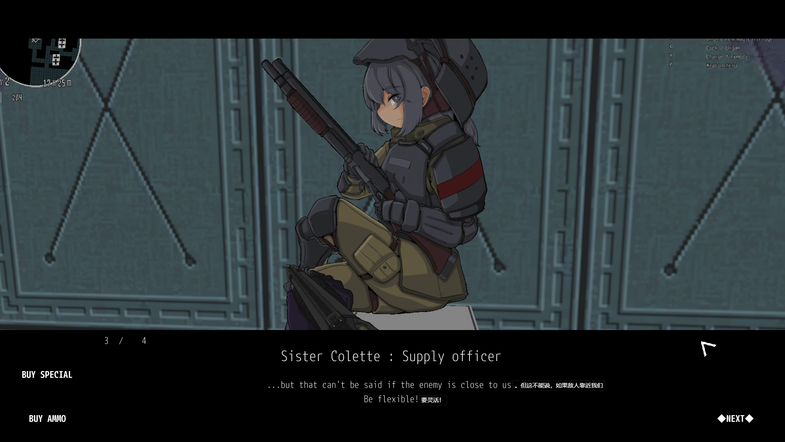
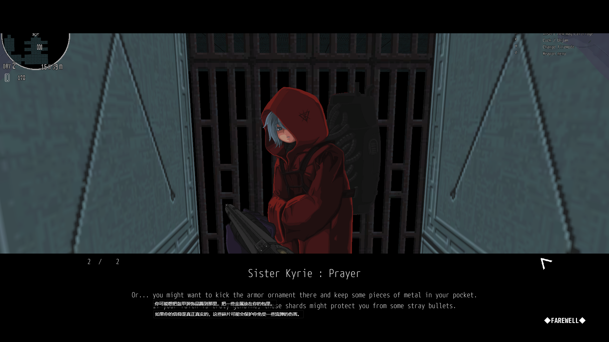
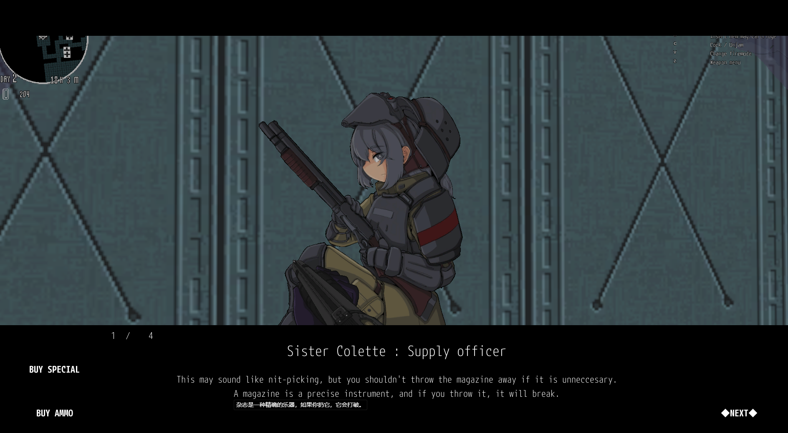

<p align="center">
  <h1 align="center">Translation Overlay | 超即时翻译</h1>
  <p align="center">实时翻译屏幕上的任何内容</p>
  <p align="center">
    <a href="https://github.com/asitass/Translation-Overlay/releases"></a>
    <a href="LICENSE"></a>
    <a href="https://github.com/asitass/Translation-Overlay/actions"></a>
  </p>
  <p align="center">
    <a href="#功能特性">功能特性</a> •
    <a href="#使用场景">使用场景</a> •
    <a href="#与其他屏幕翻译工具对比">对比</a> •
    <a href="#快速开始">快速开始</a> •
    <a href="#下载">下载</a> •
    <a href="#开发工作流">开发工作流</a> •
    <a href="#打包与分发">打包</a> •
    <a href="#cicd-流水线">CI/CD</a> •
    <a href="#故障排查">故障排查</a>
  </p>
  <p align="center">
    <a href="README.md">🇬🇧 English</a> • <a href="README.zh-CN.md">🇨🇳 中文</a>
  </p>
</p>

<p align="center">
  
</p>

选择屏幕上的任意区域，Translation Overlay 通过 OCR 识别文字，即时翻译，并以透明浮窗的形式将结果显示在原文上方。

---

## 功能特性

- **离线翻译** — Bergamot WASM 引擎本地运行，无需网络
- **4 种翻译引擎** — Bergamot（离线）、Google Translate、Ollama、DeepL，支持自动降级
- **PaddleOCR + Tesseract** — 双 OCR 引擎，自动降级确保识别鲁棒性
- **智能锁定模式** — 检测稳定内容后锁定翻译，防止闪烁
- **智能文本合并** — 自动识别段落、分栏和句子边界，翻译结果更连贯
- **双显示模式** — 并排显示或悬停显示
- **跨平台** — Windows & Linux（AppImage + NSIS 安装包）
- **SQLite 缓存** — 复用历史翻译，零重复 API 请求
- **完全可配置** — 热重载 YAML 配置 + 运行时设置界面

---

## 使用场景

| | 场景 | 说明 |
|---|---|---|
| 🎮 | 玩外文游戏 | 实时翻译菜单、对话和字幕 |

<p align="center">
  
  
  <br>
  <em>原始游戏画面（左）→ 底部显示翻译覆盖层（右）</em>
</p>
| 📺 | 观看生肉番剧/影视 | 直接在视频上显示翻译字幕 |
| 📚 | 阅读外文文档/论文 | OCR 识别并翻译屏幕上的静态文字 |
| 🛠️ | 测试本地化软件 | 无需切换系统语言即可验证 UI 翻译 |

---

## 与其他屏幕翻译工具对比

| | Translation Overlay | Translumo | ScreenTranslator | OCR-Translator |
|---|---|---|---|---|
| 离线翻译 | ✅ Bergamot WASM | ❌ | ❌ | ❌ |
| 跨平台 | ✅ Win + Linux | ❌ 仅 Windows | ❌ 仅 Windows | ❌ 仅 Windows |
| 技术栈 | Electron + TypeScript | C# .NET | C++ Qt | Python PySide6 |
| 锁定模式 | ✅ 智能稳定锁定 | ❌ | ❌ | 部分支持 |
| 许可证 | MIT | Apache 2.0 | MIT | MIT |
| 维护状态 | 活跃 | 活跃 | 已停更 | 活跃 |

---

## 快速开始

```bash
# 1. 安装
git clone https://github.com/asitass/Translation-Overlay.git
cd Translation-Overlay
npm install

# 2. 构建并运行
npm run dev
```

或者从 [Releases](https://github.com/asitass/Translation-Overlay/releases) 下载预构建安装包。

继续阅读[开发工作流](#开发工作流)、[打包与分发](#打包与分发)和 [CI/CD 流水线](#cicd-流水线)。

---

## 下载

预构建安装包请在 [Releases 页面](https://github.com/asitass/Translation-Overlay/releases) 下载。

| 平台 | 格式 | 说明 |
|----------|--------|------|
| Windows | `.exe` (NSIS) | 安装程序，可选择安装目录 |
| Windows | `.exe` (Portable) | 免安装便携版 |
| Linux | `.AppImage` | 下载后 `chmod +x` 即可运行 |

---

## 开发工作流

### 环境要求

- **Node.js** >= 18
- **npm** >= 9
- **Windows**: Build Tools for Visual Studio（`npm install -g windows-build-tools`）
- **Linux**: `build-essential`、`libnss3`、`libatk-bridge2.0-0`（运行 AppImage 需要）

### 安装

```bash
npm install
```

`npm install` 会依次触发以下 `postinstall` 钩子：

1. `electron-builder install-app-deps` — 安装并配置原生模块依赖
2. `node scripts/patch-bergamot-worker.js` — 修补 Bergamot WASM worker 的 ESM/CJS 兼容性问题及 Windows 文件路径处理
3. `node scripts/download-models.js` — 下载 OCR 和翻译模型文件（总计约 260MB）：
   - **Bergamot NMT 模型**（7 个文件，约 115MB）— en↔zh 双向翻译
   - **PaddleOCR 模型**（检测 + 识别 + 字典，约 30MB）
   - **Tesseract 训练数据**（eng + chi_sim，约 30MB）

首次安装可能需要 3-5 分钟（取决于网络速度）。模型下载失败不影响应用启动，运行时会自动降级。

### 构建流程

```bash
npm run build
```

构建过程依次执行四个步骤：

| 步骤 | 命令 | 说明 |
|------|---------|------|
| 1 | `tsc` | 编译主进程（`src/` → `dist/`，CommonJS） |
| 2 | `tsc -p tsconfig.renderer.json` | 编译渲染进程（`src/renderer/` → `dist/renderer/`，独立 JS） |
| 3 | `node scripts/copy-assets.js` | 复制 HTML、CSS 和 worker wrapper 到 `dist/` |
| 4 | `node scripts/strip-cjs.js` | 清理渲染进程输出中的 CommonJS 模板代码 |

### 命令速查

| 命令 | 说明 |
|---------|------|
| `npm run build` | 编译 TypeScript（主进程 + 渲染进程） |
| `npm run rebuild:electron` | 重编译原生模块以匹配 Electron 的 Node ABI |
| `npm run dev` | 构建 → 重编译原生模块 → 启动 Electron |
| `npm start` | 启动 Electron（需要先执行 `npm run build`） |
| `npm test` | 重编译原生依赖 + 运行 vitest 单元测试 |
| `npm run test:watch` | vitest 监听模式 |
| `npx vitest run src/test/file.test.ts` | 运行单个测试文件 |
| `npm run pack:linux` | 打包为 Linux AppImage |
| `npm run pack:win` | 打包为 Windows NSIS 安装包 + 便携版 |
| `npm run pack` | 打包为当前平台格式 |

---

## 翻译引擎

| 引擎 | 费用 | 质量 | 延迟 | 配置 |
|---|---|---|---|---|
| **Bergamot（离线）** | 免费 | 良好 | ~15ms/句 | 模型已包含（约 115MB） |
| Google Translate | 免费 | 良好 | ~500ms | 内置，无需配置 |
| Ollama | 免费 | 良好 | ~2-5s | 需要本地运行 Ollama |
| DeepL | 付费 | 最佳 | ~300ms | 需要 API 密钥 |

### 为什么选择离线版 Bergamot？

Bergamot 是 Mozilla 构建的 WASM 翻译引擎，基于 intgemm 量化 Marian NMT 模型：
- **零网络请求** — 文字不会离开你的电脑
- **~15ms/句** — 预热后速度快于任何云 API
- **支持 en↔zh** — 英语与简体中文双向翻译

---

## 代理配置

如果需要为 Google Translate API 或其他在线服务配置代理：

```bash
# 运行前设置环境变量
HTTPS_PROXY=http://127.0.0.1:7890 npm run dev
```

或创建 `.env` 文件（参考 `.env.example`）。

---

## 打包与分发

### 平台安装包

| 平台 | 命令 | 产物 |
|----------|---------|------|
| Linux | `npm run pack:linux` | `release/*.AppImage` |
| Windows | `npm run pack:win` | `release/*.exe`（NSIS）+ `release/*.exe`（Portable） |

### 交叉编译（在 Linux 下构建 Windows 安装包）

在 Linux 上运行时，`electron-builder` 会将原生模块重编译为宿主平台版本。要生成 Windows 安装包，请使用交叉编译脚本：

```bash
bash scripts/pack-win.sh
```

该脚本执行以下步骤：
1. 编译 TypeScript
2. 通过 `scripts/prepare-win-native.js` 下载 Windows 预编译原生模块
3. 将 Linux 的 `.node` 二进制文件替换为 Windows 版本（better-sqlite3、node-screenshots、sharp）
4. 以 `--config.npmRebuild=false` 运行 `electron-builder --win`（跳过原生编译）
5. 恢复原始的 Linux 原生模块

### 打包资源清单

以下资源会自动打包到安装包中：

| 目录 | 内容 | 大小 |
|-----------|----------|------|
| `bergamot-models/` | en↔zh NMT 模型 | ~115MB |
| `paddle-models/` | PaddleOCR 检测 + 识别模型 | ~30MB |
| `tessdata/` | Tesseract 训练数据（eng, chi_sim） | ~30MB |

原生模块（better-sqlite3、node-screenshots、onnxruntime-node、sharp 等）会从 asar 包中解压出来——详见 `electron-builder.yml` 中的 `asarUnpack` 配置。

---

## CI/CD 流水线

**文件**：`.github/workflows/build.yml`

**触发条件**：
- 推送 `v*` 格式的 tag（例如 `v1.0.0`）
- 推送到 `master` 分支
- 通过 GitHub Actions 界面手动触发

**任务**：

| 任务 | 运行环境 | 步骤 | 产物 |
|-----|--------|-------|------|
| `build-windows` | `windows-latest` | Checkout → Node 20 → `npm ci` → `build` → `electron-rebuild` → `electron-builder --win` | `release/*.exe` |
| `build-linux` | `ubuntu-latest` | Checkout → Node 20 → `npm ci` → `build` → `electron-rebuild` → `electron-builder --linux` | `release/*.AppImage` |
| `release` | `ubuntu-latest` | 下载两个构建任务的产物 → 创建 GitHub Release 并自动生成发布说明 | GitHub Release |

`release` 任务仅在推送 tag 时执行（`v*`），且依赖 `build-windows` 和 `build-linux` 都成功后才会运行。

---

## 故障排查

| 问题 | 解决方案 |
|---------|------|
| `npm install` 时模型下载失败 | 手动执行 `node scripts/download-models.js`。模型缺失时应用会在运行中自动降级。 |
| `Error: The module was compiled against a different Node.js version` | 执行 `npm run rebuild:electron` 重编译原生模块以匹配 Electron 的 Node ABI。 |
| AppImage 在 Linux 上无法启动 | 安装系统依赖库：`apt install libnss3 libatk-bridge2.0-0 libgtk-3-0` |
| Google Translate 无响应 | 检查 `HTTPS_PROXY` 环境变量——Google Translate 在你的地区可能被限制。 |
| 日志文件在哪？ | 日志写入应用 userData 目录下的 `app.log`。 |

---

<details>
<summary><b>架构</b></summary>

```
单 Electron 进程（TypeScript）
├── 主进程
│   ├── ScreenCapturer    — node-screenshots（跨平台截屏）
│   ├── OcrService        — PaddleOCR（首选）+ Tesseract.js（降级）
│   ├── TranslatorService — Bergamot / Google / Ollama / DeepL + 降级
│   ├── TranslationCache  — better-sqlite3（SQLite）
│   ├── ChangeDetector    — 像素对比 + 文字去重
│   ├── Pipeline          — 截屏 → 检测 → OCR → 翻译
│   └── IPC Handlers      — Electron contextBridge
├── 预加载脚本
│   └── contextBridge API
└── 渲染进程
    ├── 浮窗窗口    — 透明置顶翻译显示
    └── 设置窗口   — 引擎/语言/外观配置
```
</details>

<details>
<summary><b>项目结构</b></summary>

```
src/
├── main/
│   ├── index.ts              # Electron 入口文件
│   ├── ipc-handlers.ts
│   └── services/
│       ├── capturer.ts       # 屏幕截取
│       ├── ocr.ts            # OCR 调度（PaddleOCR + Tesseract）
│       ├── ocr-engines/      # OCR 引擎实现
│       ├── bergamot.ts       # 离线翻译（WASM）
│       ├── translator.ts     # 翻译引擎调度
│       ├── cache.ts          # SQLite 缓存
│       ├── change-detector.ts
│       ├── config.ts
│       └── pipeline/         # 截屏流水线与模式
├── preload/
│   └── index.ts
├── renderer/
│   ├── overlay/
│   └── settings/
└── shared/
    ├── types.ts
    ├── constants.ts
    └── protocol.ts

tests/
config/
scripts/
bergamot-models/
tessdata/
paddle-models/
```
</details>

---

## 贡献指南

欢迎提交 PR！请参阅 [CONTRIBUTING.md](CONTRIBUTING.md) 获取贡献指引。

## 许可证

[MIT](LICENSE)

---

<p align="center">
  <a href="https://star-history.com/#asitass/Translation-Overlay&Date">
    
  </a>
</p>
